# Git入门到企业实战

本门课程特点：直接进入高C，不讲概念、历史、不讲故事、不对比任何无聊的东西（SVN和git区别、github和gitee区别）。我本人在公司开发怎么使用git，我就怎么讲。

对比其他课程优势：一切行动都是从实际企业真实经验出发，这一点是目前其他机构git课程没有的特色！全程实操、真实企业开发、真实企业git工作流程、冲突处理都是我本人日常工作的实际方案，最后提供面试题总结。

讲一句废话算我输，本门课程视频免费，课件5块钱，http://bogeplus.com付费获取，已经加入我贵宾VIP的兄弟勿拍，我直接发VIP群共享了。

# 1. git入门

## 1.1 版本控制概述

### 1.1.1 为什么需要版本控制

程序员无论是自己学习、维护自己的项目，还是在企业中团队协作开发，都需要对代码版本进行管理。从而实现如下目的：

- 版本控制：代码写错了想要查看以前修改前的代码，或者新写的代码功能不需要了，可以随时回滚到以前的版本，同时也可以防止代码丢失；
- 团队协作：通过远程仓库、git分支管理，轻松实现团队协作，减少代码冲突、合理的分配开发任务。同时还能和各种环境（开发/测试/验收/生产）对接；
- 代码排错：解决生产环境反馈的bug、或者基于老代码进行修改或新增需求时，难免看不懂当前代码，此时你可以通过版本来追溯，分析，这段代码以前做过哪些改动，他改动的时候变化了哪些代码，从而辅助你猜测原作者的意图，或者直接看到以前是谁写的这段bug代码，直接问他（前提原作者没离职）；
- 代码审查：一些大公司对代码质量管理很严格，git分支管理已经和工作流程绑定了，如：你写的代码不会直接让你合并到主干分支，他们会对主干分支开启分支保护！并且在提交前一定会经过自动化工具（sonarLink）或者上级（组长）审查；包括未来发生bug，通过版本管理分析问题出在那里，溯源第一责任人。
- 分支管理：我认为分支管理非常重要，实际开发中，分支管理已经和工作流程、服务器环境相结合了，你学习git，不能仅仅学习分支的增删改查，要结合实际工作经验来讲！往往很多同学八股文背的贼6，面试官一问实际工作中，有哪些分支，怎么部署的？这些常识性问题，直接露馅！

不用担心，这些问题，我在下面的课程都包含了，直接100%解决你的各种需求！

### 1.1.2 版本控制相关概念

**版本控制**：版本控制工具是在软件开发中，提供协同开发、数据备份、权限控制、历史记录、版本管理、分支管理等功能的软件。

特点：

1. 协同修改，多人并行开发同一个文件，提供冲突解决方案；
2. 数据备份，可以回退到历史任意一个版本；
3. 权限控制，对团队中的开发人员权限进行控制；
4. 历史记录，查看修改代码的人员、时间、内容、日志等信息；版本管理，保存每一个版本的文件信息；
5. 分支管理，实现项目的多个模块同时开发，提高效率；


**Git**（读音为/gɪt/）是一个开源的分布式版本控制系统，可以有效、高速地处理从很小到非常大的项目版本管理。

特点：

1. 提供本地库版本管理，在本地即可实现版本控制；
2. 可以从代码托管中心（gitlab、GitHub、码云）上克隆完整的项目到本地开发环境中；
3. 提供了分支管理、合并分支功能，在本地环境就可以实现；
4. 为在团队开发遇到的文件冲突提供解决方案；

官网：https://git-scm.com/

下载地址：https://git-scm.com/downloads


写代码的程序员，一般用git较多；

美工、运维一般用svn较多；

## 1.2 git安装

官网下载：https://git-scm.com/

安装步骤：

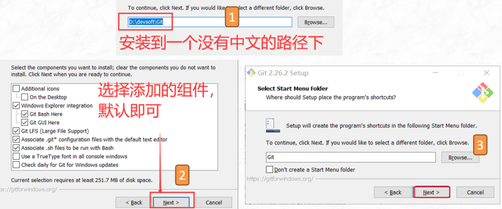

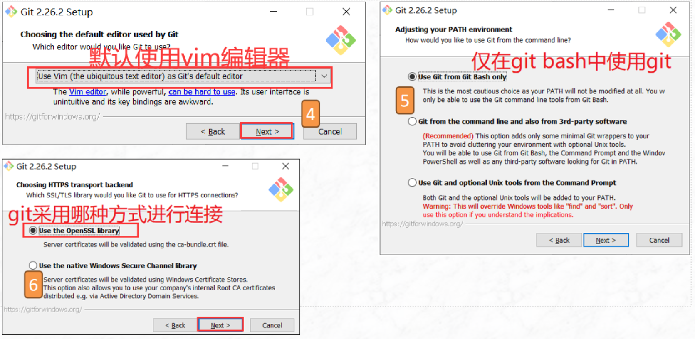

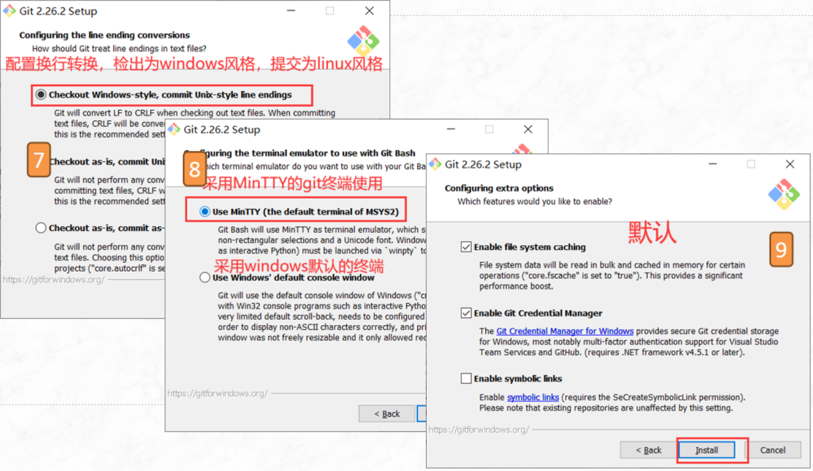


## 1.3 git基本概念


| 概念名 | 命令名       | 解释                                                         | 用途                                                         |
| ------ | ------------ | ------------------------------------------------------------ | ------------------------------------------------------------ |
| 工作区 | 无           | 实际操作和编辑文件的地方，如：Idea开发窗口                   | 实际上不存在这个概念，仅仅代表所做的修改、新建的文件尚未被git管理 |
| 暂存区 | `git add`    | 临时保存要提交的更改                                         | 很多人对暂存区无感，感觉没存在的必要，反正最后一定会提交本地库。博哥认为，不必频繁提交本地库。可将逻辑上相关、任务为一组的多次修改先暂存起来，然后一起提交，这样本地库的提交日志信息更有意义。 |
| 本地库 | 无           | 存储本地项目的历史和版本信息                                 | 保存每一次提交记录，方便随时回滚到本地任意历史版本。每次提交操作会生成独一无二的版本号，便于后续通过版本号管理、查看和回退历史版本，让人放心。 |
| 远程库 | 无           | 通常托管在网络上的云服务器中，方便团队成员共享和协作         | 程序员写完代码后推送至远程库，供大家获取和协作，常用于多人协作开发、代码共享、版本管理、代码合并及基于代码的拉取部署。企业内部常搭建 gitlab 私服，日常工作流程：工作区 - 暂存区 - 本地库 - 远程库。 |
| 分支   | `git branch` | 实现在同一项目的不同版本的 代码                              | 在开发新功能、修复重要 Bug 时创建，如功能分支、热修复分支。在相应分支单独修改，不影响其他分支，多个分支并行进行，各分支代码可以不同。但最后完成后一定会合并回主干分支。 |
| 版本   | 无           | 每次提交本地库后生成一个版本，并具备唯一的版本号             | 每次提交本地库生成唯一版本号，用于回滚、跳转，对比历史片段差异，方便溯源、代码恢复及不同版本对比，常用于发现当前版本问题或查看历史修改时，是版本管理的重要手段。 |
| 标签   | `git tag`    | 给特定的提交打标记                                           | 一旦生成，相当于某分支某时刻代码状态的快照，与分支版本后续变化无关。实际工作中，交付测试、产品验收、生产环境及发布重要版本（如正式版、里程碑版）时会打标签，代表交付状态，方便后续快速定位和识别，且标签对应的代码状态固定，不受后续分支代码修改影响。 |
| 提交   | `git commit` | 对项目中文件更改的一次记录                                   | 完成一定功能开发或有意义修改后提交至本地库，每次提交可备注简要信息，方便他人分析。每次提交应围绕一块业务、Bug 或功能的相关修改。不要频繁的多次提交不相关的修改，这样能生成一个版本，减少日志信息，方便查看。 |
| 合并   | `git merge`  | 将一个分支更改的代码整合到另一个分支                         | 分支可以互相合并，由公司分支管理流程控制。可将特性分支、Bug 修复分支等合并到开发分支、测试分支、验收分支、正式分支、master 主分支等，也可基于 master 主分支创建新的开发分支、Bug 修复分支等。这部分我后面会详细讲，很多刚培训出来的同学在这块容易露馅。 |
| 推送   | `git push`   | 将本地仓库的提交和更改上传到远程仓库                         | 在本地开发完成并确认无误后，将更改推送到远程库，让团队成员能够获取到最新的代码 |
| 拉取   | `git pull`   | 从远程仓库获取最新的更改并合并到本地仓库                     | 当其他成员将更改推送到远程库后，你可以拉取更新一下，如果拉取下来的代码和你的本地修改的代码有冲突，那么就需要解决冲突了。 |
| 重置   | `git reset`  | 撤销提交或者将工作目录和暂存区恢复到指定版本号的仓库状态     | 比如说代码写错了但是提交上去了，或者过去的修改的代码想要恢复一下 |
| 克隆   | `git clone`  | 从现有的远程仓库拉取到本地，并创建本地仓库                   | 进了公司第一件事就是将公司私服仓库项目拉去到自己的电脑上     |
| 冲突   | 无           | 合并分支、拉取远程库时，因不同版本对相同代码的修改引发的冲突 | Git 仓库版本有顺序。在本地库合并分支或向远程库推送修改时，因版本不同，相同文件的相同行代码被不同版本修改，就会引发冲突。git工具无法知晓业务意图，不知道哪个版本的修改更符合业务需求，那么此时就需要你手动处理冲突。<br/> 例如，一个团队中，A 在分支 1 中修改了文件 `example.txt` 的第 10 行代码，B 在分支 2 中也修改了这一行代码。当合并这两个分支时，Git 无法确定应该采用谁的修改，就会产生冲突，需要开发人员自己决定如何解决。 |


git命令有很多，上面这些用于入门。


## 1.4 git基本工作流程

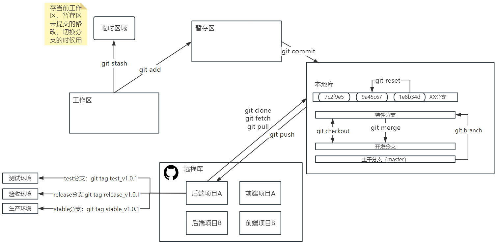


# 2. 常用命令

## 2.1 仓库初始化命令

**命令**：

```shell
git init
```

**解释**：用于初始化一个新的 Git 仓库。在执行此命令的目录中创建一个隐藏的 `.git` 文件夹，该文件夹包含了 Git 仓库的所有配置和跟踪信息。这个文件夹不能删，一旦删除，就代表该项目不再是git项目，不受git管理了。

**案例**：

```shell
mkdir boge-project
cd boge-project
git init
```

签名配置：

签名：代表不同的开发人员，仅作为区分功能，签名由有户名与邮箱组成，一般命名为你在公司的名字、邮箱即可。

按照签名作用范围，可以分为：

- 系统用户签名：登录的当前操作系统的用户范围，没有特殊需求，默认系统用户签名就可以:

  ```shell
  git config --global user.name boge
  git config --global user.email boge@qq.com
  ```

  

- 项目级别签名：

  ```shell
  git config user.name boge
  git config user.email boge@boge.com
  ```

  

## 2.2 代码修改提交命令

| 命令         | 解释                                                         |
| ------------ | ------------------------------------------------------------ |
| `git init`   | 用于初始化一个新的 Git 仓库。在执行此命令的目录中创建一个隐藏的 `.git` 文件夹，该文件夹包含了 Git 仓库的所有配置和跟踪信息。这个文件夹不能删，一旦删除，就代表该项目不再是git项目，不受git管理了。 |
| `git status` | 用于显示工作目录和暂存区的状态：哪些文件被修改、哪些文件已添加到暂存区、哪些文件还未被跟踪等信息。 |
| `git add`    | 将文件添加到暂存区，以便后续进行提交。                       |
| `git reset`  | 用于撤销某些操作，如将已暂存的文件从暂存区移除               |
| `git commit` | 将暂存区的内容提交到版本库，并添加提交消息来描述此次提交的更改，同时生成唯一ID标识该版本号 |


git add/commit命令补充：

- 首次添加新的文件，使用`git add`命令，然后再使用`git commit`命令；
- `git commit -m` 命令是一种简写方式，直接在命令行输入命令；
- 再次对已经受到git管理的文件，进行修改后，直接使用`git commit -a -m` 即可提交当前所有做出的修改操作；

切记：git版本号非常重要，一切git本地库、远程库、分支管理等行为，都是建立在git版本号之上。每次提交，都会产生一个新的git版本号，不管你以后干啥，把git版本号放在心上！

git reset命令补充：

- 使用`git reset HEAD 文件名`可以将暂存区的文件移除，退回到工作区，但是做出的代码修改还在；
- 使用`git reset --soft HEAD^`代表回到上一个版本，可以撤销最近一次`git commit `的提交，撤回前的代码从本地库回退到暂存区；
- 使用`git reset --hard HEAD^`代表撤回上一个版本，可以撤销最近一次`git commit `的提交，回到上一个版本初始时状态，等同于丢失了最近一次提交的代码；


## 2.2 日志查看命令

日志命令一定要熟练记住前两个，实际工作中，用于查看某些分支的提交信息，根据变动的代码、备注的注释（`commit -m 注释`），来辅助你熟悉、分析代码。

| 命令                          | 解释                                                         |
| ----------------------------- | ------------------------------------------------------------ |
| `git log`                     | 显示提交详细的日志，包括每次提交的提交ID、作者、日期和提交信息 |
| `git log --oneline`           | 以单行形式显示提交日志，每条提交只显示提交ID的简短版本和提交信息 |
| `git log -p`                  | 显示每次提交的差异信息                                       |
| `git log --author="<作者名>"` | 显示特定作者的提交日志，用来审查某些组员的代码               |
| `git reflog`                  | 以单行形式显示提交日志，显示：ID简短版、HEAD步数和提交信息   |

日志命令补充：

- 日志如果太多，可以使用：空格（下一页）、b（上一页）、q（退出）


## 2.3 版本回退命令

| 命令                            | 解释                                                         |
| ------------------------------- | ------------------------------------------------------------ |
| `git reset`                     | 用于撤销某些操作，如将已暂存的文件从暂存区移除、将 HEAD 指针移动到指定的提交 |
| `git reset --soft 版本号HEAD^`  | HEAD^只移动 HEAD 指针，保留工作目录和暂存区的更改            |
| `git reset --mixed 版本号HEAD^` | HEAD^HEAD^移动 HEAD 指针，不保留暂存区，保留工作区。这是 的默认选项 |
| `git reset --hard 版本号|HEAD^` | 移动 HEAD 指针，非常硬，直接硬硬的干到指定版本初始状态，不保留暂存区和工作区，不同版本之间差别都丢掉 |
| `git diff`                      | 用于**比较工作目录与暂存区**、工作目录与某个提交、两个提交之间等的差异 |
| `git diff --cached`             | 比较暂存区和最近一次提交的差异                               |
| `git diff <commit1> <commit2>`  | 比较两个指定版本号提交之间的差异，在对比不同版本代码、分析业务变动、出现bug原因分析时非常管用 |

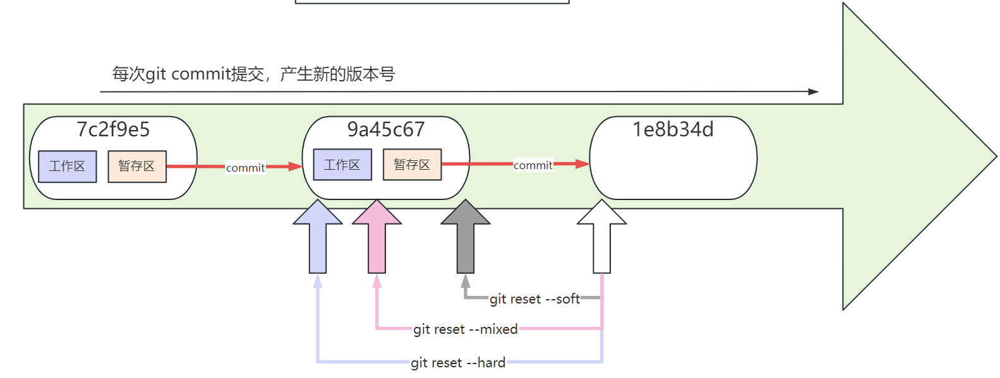

## 2.4 代码暂存

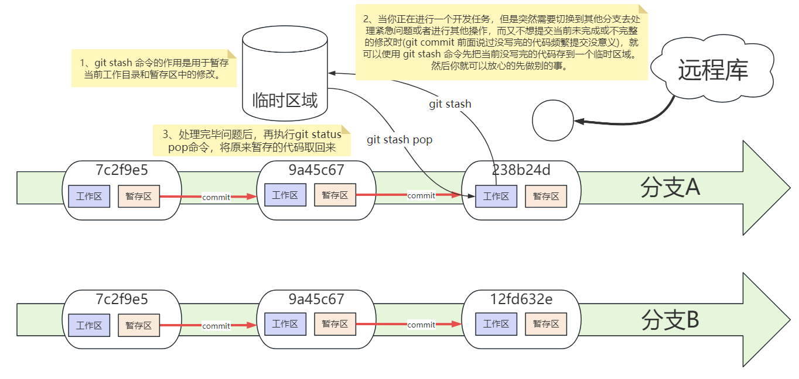

`git stash` 常用的命令参数包括：

- `git stash save "message"`：保存暂存修改时添加自定义的描述信息。
- `git stash list`：列出所有暂存的修改记录。
- `git stash pop`：恢复最近一次暂存的修改，并从暂存列表中删除它。
- `git stash apply`：恢复指定的暂存修改，但不会从暂存列表中删除。
- `git stash drop`：删除指定的暂存记录。
- `git stash clear`：删除所有的暂存记录。


# 3. 分支和标签管理

## 3.1 分支

### 3.1.1 什么是分支

在 Git 中，分支是指项目开发过程中的不同路线的版本。

我们可以基于某一个分支作为起源，复制出来多个不同的分支，在此时此刻，多个分支可以同时进行，不同的程序员，在不同的分支进行针对性的开发。

**分支应用场景**

**热修复分支修复生产环境紧急bug案例**

实际企业工作中，生产环境不可避免的遇到bug，但是bug也分轻重缓急：

- 轻微的bug，如：页面元素展示、前端布局、时间格式、查询字段不正确等能够容忍的bug，一般在当前开发分支进行顺便修改，随着下次发版解决；
- 严重的bug，如：直接面向C端用户的业务、财务、各种Error、严重生产日志Bug，这些通常无法容忍，需要立刻开一个独立的修复分支，快速修复、立刻发版；

**特性分支开发不同的新需求**

每当需求下发后，任务一定是均摊到多个项目小组成员身上，我们可以把任务分一分，不同的人负责不同的业务，分支也可以不一样：

- 功能需求A：简单，分给张三一个人完成，张三单独一个分支；
- 功能需求B：麻烦，分给高手李四一个人完成；
- 功能需求C：太多了，分给王五赵六两个人一起完成；

开发人员可以根据自己的需求，创建各自的分支，并行进行开发。

多个人同时在各自分支开发，不会影响别人分支的代码，当然，最后新增的需求，肯定还是要合并在一起的！

### 3.1.2 git分支命令

| 命令                                     | 解释                                                   |
| ---------------------------------------- | ------------------------------------------------------ |
| `git branch`                             | 列出本地的所有分支。-v 查看详细提交状况                |
| `git branch <branch_name>`               | 创建一个新的分支。                                     |
| `git checkout <branch_name>`             | 切换到指定的分支。                                     |
| `git merge <branch_name>`                | 将指定的分支合并到当前分支。                           |
| `git branch -d <branch_name>`            | 删除指定的本地分支（如果分支未合并，可能会提示错误）。 |
| `git branch -D <branch_name>`            | 强制删除指定的本地分支，无论是否已合并。               |
| `git push origin <branch_name>`          | 将本地分支推送到远程仓库。                             |
| `git push origin --delete <branch_name>` | 删除远程仓库上的指定分支。                             |
| `git fetch origin`                       | 从远程仓库获取最新的分支信息，但不会自动合并。         |

## 3.2 真实企业工作分支管理方案

我们拆分主分支（master）、四大主干分支（dev、test、release、stable），这些分支在创建项目时，同时创建出来。

不同公司的分支管理方式不一样，这里博哥列举的是我实际工作中的分支管理方案。

图很大，看不清的话看我在线地址：

https://www.processon.com/view/link/6693f43c964573210617ed21?cid=6693e23a964573210617de4c

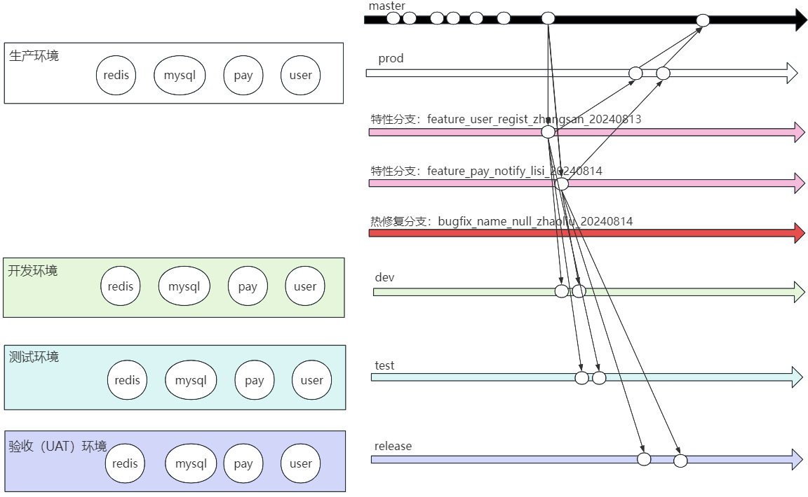

1. 主分支：

   - 永远保存当前稳定版本的代码，与生产环境保持完全一致。
   - 永远只能合并稳定分支的代码。
   - 每当新建开发或修复分支时，均需从主分支中创建。
   - 命名规则：`master`

2. 开发分支：

   - 用于保存当前开发阶段的代码，为前后端程序员所用。
   - 前后端程序员在完成部分功能后即可提交至开发分支进行自测。
   - 此分支仅供程序员自用，无需向测试或产品人员交付，且不需要 `tag` 标签管理。
   - 只能合并特性分支和修复分支，主要用于功能自测及前后端联调。
   - 命名规则：`dev`

3. 测试分支：

   - 专门保存测试阶段的代码，仅限测试工程师使用。
   - 由程序员自测通过后交付给测试，此过程需要 `tag` 标签管理。
   - 只能合并特性分支和修复分支，用于对修改部分的代码进行测试。
   - 命名规则：`test`

4. 验收分支：

   - 用于保存产品或业务研究验收阶段的代码，仅限产品经理使用。
   - 需在程序员和测试工程师通过后交付给产品，且需要 `tag` 标签管理。
   - 只能合并特性分支和修复分支，用于对这部分变更的需求进行验收。
   - 命名规则：`release`

5. 稳定分支：

   - 保存产品验收通过的代码，择良辰吉日进行投产（发布至正式环境）。
   - 需由程序员、测试和产品人员全部通过后交付给运营，同时需要 `tag` 标签管理。
   - 只能合并特性分支和修复分支，用于等待投产。
   - 命名规则：`stable`

6. 特性分支：

   - 保存前后端程序员正在开发的功能代码，仅供程序员使用。
   - 由前后端依据具体的业务需求和任务分配情况创建各自专属的分支。
   - 特性分支对应每一个特定的开发周期，交付完成后不可重复利用。
   - 特性分支只能向开发、测试、验收、稳定这四大主干分支进行合并。
   - 命名规则：`feature_需求_开发人员_年月日`

7. 修复分支：

   - 保存针对生产环境中重大、紧急 `bug` 的修复代码，仅供程序员使用。
   - 修复完成并经过充分测试、产品验收后，实现快速投产。
   - 修复分支只能向开发、测试、验收、稳定这四大主干分支进行合并。
   - 命名规则：`bugfix_bug 问题_开发人员_年月日`

   

## 3.3 标签

### 3.3.1 为什么需要标签管理？

在实际企业工作中，任何工作的环节都需要留存记录、保留痕迹，以便于划分职责、问题溯源等。

留存记录的方式有很多种：文件签字、邮件、钉钉或内部OA，总之，出了问题要找到第一责任人，那么这些痕迹都是“证据”。


同样，一个阶段的需求，从提出到实现，需要开发程序员、测试工程师、产品经理多人协同配合完成。

这个过程中，很容易出现一些意想不到的情况，比如以下场景：

- 程序员完成代码编写后，向测试工程师呼喊：“你可以验收啦！”

- 于是，测试工程师从 Git 远程仓库拉取代码，并进行以下操作：

- 测试工程师进行后端部署：构建 Java 项目、部署 Java 微服务。通常微服务项目会通过 Jenkins 管理部署流程，测试工程师只需简单的鼠标操作就能将代码部署到测试环境运行，如果遇到复杂操作，自然会有运维同事帮忙部署。
- 测试工程师进行前端部署：测试工程师拉取前端代码，打包生成测试环境的 App、小程序等，并安装在自己的设备、手机上进行测试。
- 测试工程师执行自动化测试（代码质量检测、UI 自动化测试）等操作。

在测试工程师验收过程中，如果遇到问题，会与程序员反复沟通。程序员在本地修复 bug 后推送到远程库，测试工程师再次进行测试。

在此期间，会出现一些常见的情况：

- 测试工程师会频繁地拉取 `test` 分支代码，开发工程师也会频繁地向`test`分支提交代码，这是很正常的现象。
- 假设经过多次反复修改，测试工程师测试没问题并通过。但与此同时，下一秒，开发程序员可能又将一些新代码提交到了远程库，而这些新代码尚未经过测试。这就可能导致测试通过的代码中混入了尚未测试的代码，从而带来潜在风险。
- 类似的问题也可能发生在产品验收阶段。由于不同主干分支的代码可以随意提交修改，因此产品验收通过的代码也可能会被不小心修改。


所以，在这个案例中，暴露出了日常工作中的一些问题：

- **沟通不当**：开发、测试和产品经理之间的协作流程不应仅仅依靠口头沟通，而应该通过邮件、钉钉、企业微信等工具来确保信息传达的准确性和可追溯性。

  **交付流程不明确**：在开发向测试交付、测试向产品交付、产品向运营或甲方交付的每一个环节中，交付的代码应该是一个最终确认的版本，不应在验收后出现随意修改的情况。

解决方案：

邮件、固定的工作流程、git标签都是重要的手段，不同公司方式不一样，关于如何发邮件这些题外话，博哥就不在这里废话了。

- 制定完整的工作流程：

  - 开发完成自测后，向测试发送“提测”邮件。同时将当前开发的特性分支合并到测试分支，并且测试分支仅限运维、高级开发及测试工程师操作，普通组员不得随意操作。每次将特性分支新代码合并至测试分支时，都需创建新的 Git 标签（git tag test_v1.0.1）以标识新的版本。

    并且要在邮件中写清楚，当前最新标记（git tag标签）是多少、做出哪些业务模块修改、方便运维、测试部署，避免发了新的代码，结果还是部署旧的；

    

  - 测试通过后，向产品发送“验收申请”邮件。同时将当前开发的特性分支合并到验收分支，验收分支仅允许运维、产品经理及技术经理操作，开发和测试不得随意操作。每次合并新代码时，同样创建新的 Git 标签（git tag release_v1.0.1）。

    并在邮件中详述修改的业务模块及最新标签。此分支的版本应基本无重大 bug，作为最终交付版本，有人称其为定板分支。

    

  - 产品验收通过后，发邮件给全体研发团队告知“验收通过”，将特性分支合并到稳定分支，同时创建新的Git标签（git tag stable_v1.0.1）。最后选一个黄道吉日（运营或者总经理定），将新版本发布到生产环境，最后的最后，将稳定分支的代码合并到master主分支。

    

- 对于开发交付给测试、测试交付给产品、产品交付给运营的每一环节的“成果”，都确认下来，这就是Git 标签（git tag）的核心作用。一旦确认，不可随意变更，若需更改，那就重新遵循工作流程走一遍前面的每一个步骤。

而上面我说的解决方案，就是通过 Git 的标签（tag）来实现。Git 标签能够为特定的代码提交创建一个具有明确标识和描述的标记，确保在各个工作环节中，交付的代码版本具有确定性和可追溯性，避免因代码的随意修改导致的混乱和错误。

### 3.2.2 什么是标签

Git 标签是为某个状态的分支版本创建一个标记，标记的一个易于辨识的名称。

大白话说，就是给特定版本的代码打上标记，永远记住了奥，这个标签对应哪个版本代码！这有助于在后续开发、工作流程、项目部署中快速且精准地引用、识别、部署项目到不同的服务器环境。

你给我记清楚了 ：Git标签是基于某一个分支的当前状态创建，标签生成后，便与当前分支再无关联，前世的姻缘不可留恋半分。

每个 Git 标签所记录的版本状态无法更改，仅能新增或删除！

这就好比：你在 10 岁时拍了一张照片，这张照片永远定格了你 10 岁的模样。即便 20 年过去，你自身发生了巨大变化，也无法影响当初照片中的样貌！你可以重新拍摄新照片，或者撕掉旧照片，但永远无法改变 10 岁时照片的容颜！


在企业项目中的作用：

- 版本标记：为软件的发布版本进行标记，例如 `test_v1.0.1`、`release_v1.1.1` 等，便于后续回溯并识别重要的发布节点。
- 项目里程碑：标记项目内的重要里程碑，比如完成某个关键功能或阶段，对应着每次向测试、产品、正式环境交付的一个阶段、标记（**也能避免扯皮**）。
- 便于回滚：能够基于标签迅速回滚至特定的历史版本。


回到前面的问题，无论是开发交付给测试、测试交付给产品，还是产品验收通过后，等待正式投产。这其中每一次跨岗位的工作内容交接，都是基于git tag打一个标签，这个标签固定了重要的节点（里程碑）！

| 命令                                 | 解释                                     |
| ------------------------------------ | ---------------------------------------- |
| `git tag <tag_name>`                 | 创建一个轻量标签，指向当前的提交。       |
| `git tag -a <tag_name> -m "message"` | 创建一个带注释的标签，并添加注释信息。   |
| `git tag -d <tag_name>`              | 删除指定的标签。                         |
| `git show <tag_name>`                | 查看指定标签的详细信息。                 |
| `git push origin <tag_name>`         | 将本地创建的标签推送到远程仓库。         |
| `git push origin --tags`             | 一次性推送所有本地创建的标签到远程仓库。 |
| `git pull origin --tags`             | 从远程仓库拉取所有标签到本地。           |


## 3.4 真实企业工作标签管理方案

### 3.4.1需求背景

- **日期**：2024年8月14日
- **需求**：产品团队提出了一项新的功能需求，并在评审会议中得到了通过。
- **目标**：根据新需求完成从开发到生产的全流程管理，这其中涉及到分支、环境和标签的管理。

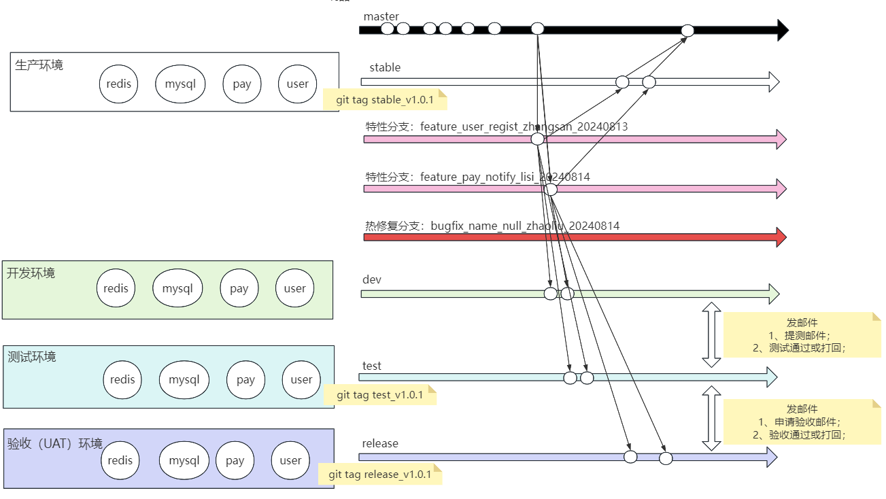

### 3.4.2 创建特性分支

**步骤**：

- **前后端程序员从 `master` 分支创建特性分支**：为实现新需求，从 `master` 分支创建一个新的特性分支，命名为 `feature_xxx_需求_姓名_20240714`。

- **命令**：

  ```shell
  git checkout master
  git pull origin master
  git branch feature_xxx_需求_姓名_20240714
  ```

**解释**：

- 该特性分支用于开发与新需求相关的功能，所有的开发工作将在这个分支上进行。
- 当然，前端的项目与后端的项目是两个git项目，但是各自内部的分支管理方式肯定是一样的。

### 3.4.3 开发与联调

**步骤**：

- **前后端联调**：在开发过程中，前端和后端开发人员可以在各自项目的各自特性分支中进行独立开发。

  比如说，开发了三四天，OK，前后端程序员各自的任务写完了，或者写的差不多了，就可以对接口了。此时，就需要后端程序员将代码部署到开发环境，前端程序员请求开发环境接口，联调他的PC、App等前端项目。

- **合并至 `dev` 分支进行联调和自测**：

  - 如果前后端需要联调或开发人员需要进行自测，可以将特性分支的代码合并到 `dev` 分支进行集成测试。

- **命令**：

  ```shell
  git checkout dev
  git pull origin dev
  git merge feature_xxx_需求_姓名_20240714
  git push origin dev
  ```

**解释**：

- `dev` 分支用于开发阶段的集成和自测，不需要标签管理（程序员自己用的分支又不用向谁交付）。开发人员可以在此分支上自测、前后端程序员对接口。
- 只有跨岗位协作，交付内容时，如：开发向测试交付等待测试的代码、测试向产品交付测试通过等待验收的代码时，结合公司研发团队管理制度，通过邮件管理工作流程，通过标签管理交付的项目。

### 3.4.4 交付测试

**步骤**：

- **前后端代码开发完毕并自测通过，合并特性分支至 `test` 分支**：

  - 当开发完成并通过自测后，将 `特性分支或者bug修复分支` 的代码合并至 `test` 分支，为测试工程师准备测试环境。
  - 创建 `test` 标签以标识提交给测试的版本，并写邮件申请测试。

- **命令**：

  ```shell
  git checkout test
  git pull origin test
  git merge feature_xxx_需求_姓名_20240714
  git tag test_v1.0.1
  git push origin test
  git push origin test_v1.0.1
  ```

**解释**：

- `test` 分支用于测试阶段，测试人员使用该版本进行功能测试，确保代码符合需求。
- 命名规则：test_v1.0.1，依次向后递增版本号；

### 3.4.5 交付产品验收

**步骤**：

- **测试通过后合并至 `release` 分支**：

  - 测试工程师确认测试通过后，将 `特性分支或者bug修复分支` 分支的代码合并至 `release` 分支，为产品经理或业务研发团队准备验收环境。
  - 创建 `release` 标签以标识交付验收的版本，并写邮件申请验收。

- **命令**：

  ```shell
  git checkout release
  git pull origin release
  git merge feature_xxx_需求_姓名_20240714
  git tag release_v1.0.1
  git push origin release
  git push origin release_v1.0.1
  ```

**解释**：

- `release` 分支用于产品验收，确保所有的变更都已经经过测试并准备好进入生产阶段。
- 命名规则：release_v1.0.1，依次向后递增版本号；

### 3.4.6 生产环境发布

**步骤**：

- **择吉日将 `特性分支或者bug修复分支` 分支的代码合并至 `stable` 分支**：

  - 产品经理通过验收后，选择一个合适的时间，将 `特性分支或者bug修复分支` 分支的代码合并至 `stable` 分支，准备生产环境发布。
  - 创建 `stable` 标签标识生产环境发布的版本。

- **命令**：

  ```shell
  git checkout stable
  git pull origin stable
  git merge feature_xxx_需求_姓名_20240714
  git tag stable_v1.0.1
  git push origin stable
  git push origin stable_v1.0.1
  ```

**解释**：

- `stable` 分支代表了即将发布的稳定代码。此时代码已经通过了所有的开发和测试环节，准备在生产环境中运行。
- 命名规则：stable_v1.0.1，依次向后递增版本号；

### 3.4.7 更新 `master` 分支

**步骤**：

- **从 `stable` 分支更新 `master` 分支**：

  - 生产环境发布成功后，将 `stable` 分支的代码合并回 `master` 分支，确保 `master` 分支永远与当前生产环境保持一致。

- **命令**：

  ```shell
  git checkout master
  git pull origin master
  git merge stable
  git push origin master
  ```

**解释**：

- `master` 分支是生产环境的主分支，必须始终与生产环境保持同步，以便在未来的开发中提供稳定的基础版本。
- 下次迭代周期下发需求后，从master分支继续检出特性分支或者bug修复分支，周而复始这个流程；

### 3.4.8 工作流程总结

整个流程从 `master` 分支开始，经历了特性分支的创建、开发人员的自测和联调、测试工程师的测试、产品经理的验收，以及最终的生产环境发布。

在每个跨岗位交付的阶段，我们使用git tag标签来标记交付的内容，通过这种规范的分支管理和标签管理，可以确保每个环节的代码质量，减少问题的发生，并提高项目的交付效率。


## 3.5 分支合并冲突问题分析及处理

### 3.5.1 什么是冲突

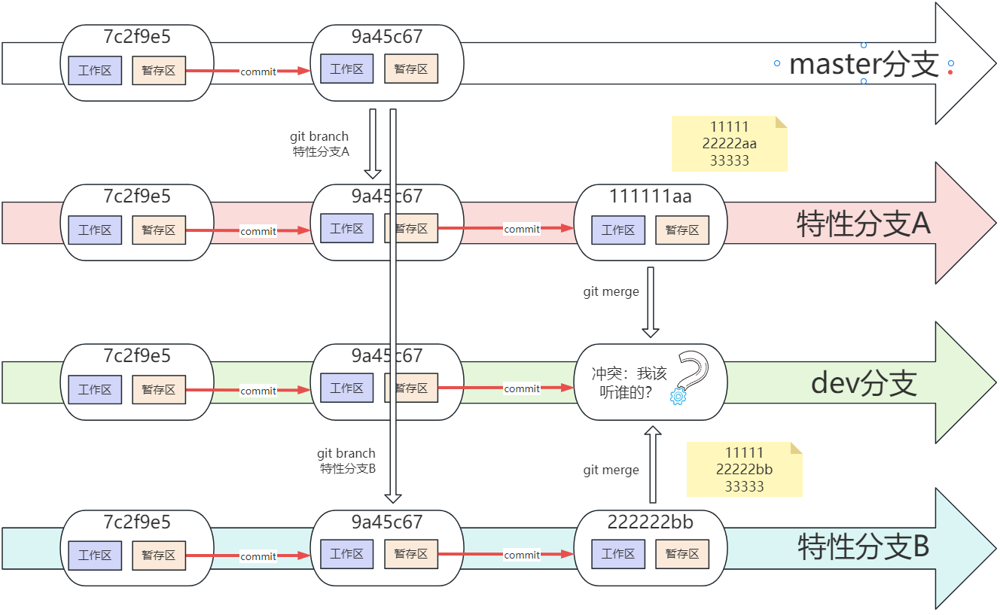

### 3.5.2 常见产生冲突的可能性

1. 合并分支时：如果不同分支对同一个文件的相同行代码进行了修改，便会产生冲突。

2. 合并远程分支时：一个团队中，多人同时对相同代码进行了不同的修改，然后各自提交本地库、推送远程库。后执行的同学一定会遇到冲突；

   本质原因是：前一个同学提交代码到远程库，产生新的版本号。后执行的同学也要推送远程库时，git会判断，诶呦，版本号变更了，我先把远程库的拉下来（git pull），再合并（git merge）本地修改的代码，进行推送。那么就在合并的过程中，发现不同人对相同代码的修改，git无法帮你抉择，于是抛出冲突；

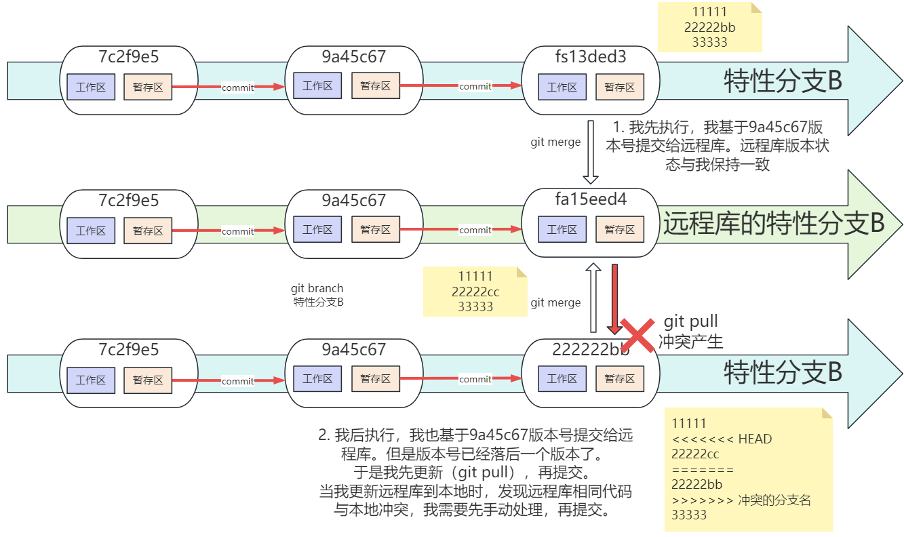

3. 拉取远程仓库的分支时：其实，即便你不提交代码到远程仓库，仅仅是更新远程仓库代码合并到本地仓库，也可能会遇到冲突。无论是自动合并（git pull）还是手动合并（git fetch ;git merge），如果遇到对相同代码的修改，也会报冲突；


### 3.5.3 产生冲突的根本原因

每次提交代码，Git都会为当前提交生成一个独一无二非常长的一串HASH值，博哥这里就管它叫版本号。

能不能、会不会发生冲突，铁铁，你就给我盯紧了版本号。我说过，每个分支有各自的版本号，每次提交都会产生新的版本号。

无论本地合并分支、合并远程分支、推送代码到远程仓库，都会自动比较当前分支与被合并分支（另一个本地分支或者远程分支）指针所指向的版本号是否存在差异。

如果是本地库：合并过程中，遇到代码冲突，直接抛出代码冲突，由程序员手动解决；

如果是远程库：会先提示你：本地库版本落后，请你执行`git pull`命令更新一下远程库代码，当你更新远程库代码到本地库时，遇到代码冲突，直接抛出代码冲突，由程序员手动解决；

当然，如果都没遇到冲突，万事大吉，直接合并你新增的修改，重新提交、推送远程库就可以了。

总的来说，无论是本地库还是远程库，冲突的根本原因都是对相同文件的相同部分进行了不一致的修改，导致 Git 无法自动确定最终的正确版本。

再补充一句，关于远程库，git一定是基于最新版本号进行下一次更新，如果你本地不是最新版本号，那么请先执行`git pull`命令，更新远程库最新状态到本地，合并本地代码，再重新推送给远程库，产生一个新的远程库版本号，下次提交周而复始。

### 3.5.4 如何解决冲突

| 命令        | 功能描述                                                     | 影响区域                           |
| ----------- | ------------------------------------------------------------ | ---------------------------------- |
| `git pull`  | 拉取远程仓库的更新并自动合并到当前本地分支，等同于下面两个命令合体，最常用。 | 本地分支和远程分支同步             |
| `git fetch` | 从远程仓库下载更新到本地的远程追踪分支，但不进行合并，而是抓到一个新的分支上，适合组长审核代码、或者合并一些不放心的其他人的代码时使用。 | 仅更新远程追踪分支，不影响本地分支 |
| `git merge` | 将指定的分支（本地或远程追踪分支）的更改合并到当前分支。     | 合并分支，不涉及远程仓库的直接操作 |

实操1：本地分支合并，主要用到git merge命令。

实操2：本地分支合并遇到冲突如何处理。

本地分支冲突处理步骤：

1. git merge 合并，遇到冲突；
2. 手动解决冲突；
3. 执行git commit提交处理后的结果；


下面两个远程仓库实操，留在【4. 远程仓库管理/4.6 远程仓库推送冲突处理】进行讲解。

实操3：远程分支合并，使用git pull命令。

实操4：远程分支合并，使用git fetch + git merge命令。


# 4. 远程仓库管理

## 4.1 什么是远程仓库

概念：远程仓库是存储在网络上的Git仓库。

作用：

- 代码开源：我是一个技术爱好者，我可以把我的作品开源，和道友们一起交流，同时提供建议（Issues）、合并道友们给的代码(pull Request）等等，如：Apache等基金会项目、MybatisPlus、RuoYi等；
- 公司团队协作：通常将代码远程仓库部署在公司私服，公司内网（192/172）开头的局域网内部服务器中，仅限公司内部使用，如果在家使用，需要运维给你开VPN；

GitEE、GitHub博哥就不说了，我们就自己搭建GitLab，一比一模拟企业级应用。


## 4.2 linux环境搭建gitlab

gitlab官网：https://about.gitlab.com/

GitLab 不仅是一个远程代码仓库管理平台，还提供了全面的 DevOps 解决方案。尽管 DevOps 本质上是一种方法论，但 GitLab 在 DevOps 实践中提供了许多强大的功能，包括：

- **分支权限管理**：通过保护分支来控制对代码的访问权限。这个我后面会讲。
- **流水线集成**：自动触发各种操作，如代码质量检测、自动部署及执行自定义脚本。 DevOps 不是本课程的重点，这个我就不讲了。
- **WebHook**：实现系统间的自动化和集成。 DevOps 不是本课程的重点，这个我就不讲了。

你可以通过搜索我的【DevOps课程】了解更多相关内容。

安装步骤：

1. 准备一台2C4G以上配置服务器，GitLab很大；

2. 准备镜像源：

   ```shell
   sudo curl -o /etc/yum.repos.d/CentOS-Base.repo http://mirrors.aliyun.com/repo/Centos-7.repo
   sudo yum clean all
   sudo yum makecache
   
   ```

3. 安装gitlab：https://about.gitlab.com/install/#centos-7

   ```sh
   # 前置准备
   yum install -y curl policycoreutils-python openssh-server perl
   systemctl enable sshd
   systemctl start sshd
   firewall-cmd --permanent --add-service=http
   firewall-cmd --permanent --add-service=https
   systemctl reload firewalld
   
   # 下载安装脚本
   curl https://packages.gitlab.com/install/repositories/gitlab/gitlab-ee/script.rpm.sh | sudo bash
   
   # 安装
   EXTERNAL_URL="http://192.168.100.110" yum install -y gitlab-ee
   ```

4. 系统会随机生成一个密码并存储在 `/etc/gitlab/initial_root_password` 文件中， 查看随机密码并使用 `root` 用户名登录。


浏览器访问：ip:80，访问gitlab页面，并使用root账户+临时密码登录：

启动过程中如果遇到下图所示502等会儿，它在初始化：

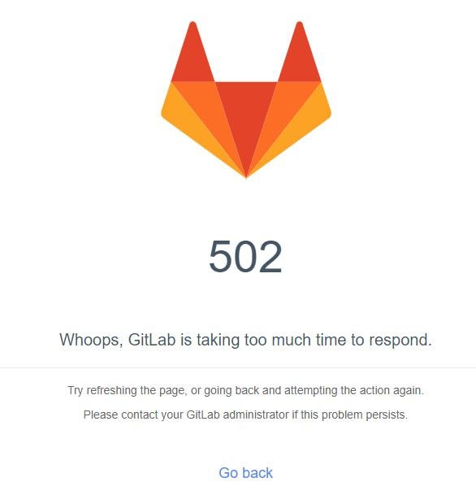 

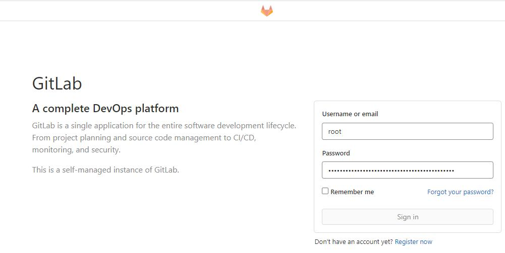 

 

 

第一次登录需要重置一下root密码：

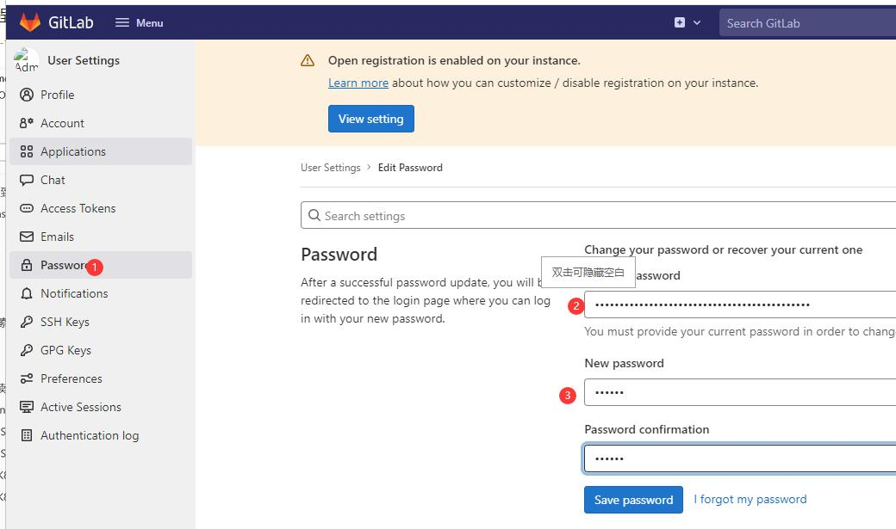 

修改一下中文： 

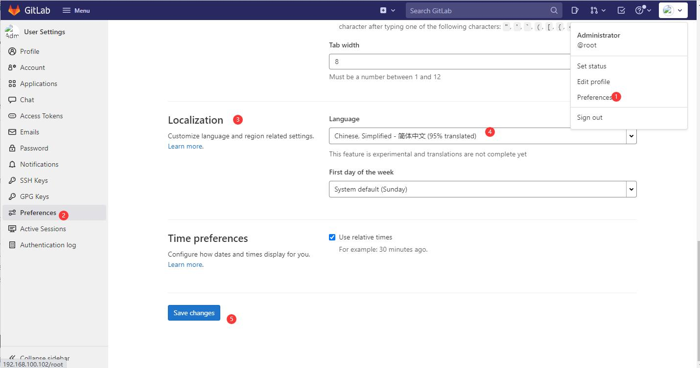 

改完后刷新，实现中文页面：

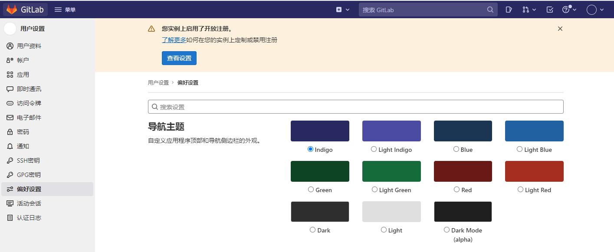 

## 4.3 远程仓库创建及权限管理

### 4.3.1 远程库相关命令

| 命令                                      | 解释                                                         |
| ----------------------------------------- | ------------------------------------------------------------ |
| `git remote -v`                           | 查看已配置的远程仓库的详细信息，包括名称和 URL。             |
| `git remote add <name> <url>`             | 添加一个新的远程仓库，`<name>` 是自定义的远程仓库名称，`<url>` 是仓库的地址。 |
| `git fetch <remote>`                      | 从指定的远程仓库获取最新的提交和分支信息，但不会自动合并。   |
| `git pull <remote> <branch>`              | 从指定的远程仓库拉取指定分支的更改，并尝试合并到当前分支。   |
| `git push <remote> <branch>`              | 将本地分支的提交推送到指定的远程仓库的对应分支。             |
| `git clone <url>`                         | 从远程仓库克隆整个项目到本地。`origin` 是 Git 中默认的远程仓库名称。 |
| `git remote rename <old_name> <new_name>` | 重命名已有的远程仓库。                                       |
| `git remote remove <name>`                | 删除指定的远程仓库配置。                                     |

### 4.3.2 版本号

版本号非常重要，每次提交本地库、远程库，都会更新一次版本号。

请您记住了：

1. 远程库也是GIT仓库，每次提交，一定会更新一个新的版本号！

2. 团队协作时，如何判断您本地库是否落后于远程库，以及如何判断是否冲突，一都是基于版本号判断的；
3. 本地库版本号与远程库版本号是同步的，如：本地库commit产生一个新的版本号，会随着`git push`命令推送给远程库。远程库版本号发生改变（其他人提交的），也会随着本地执行`git pull/fetch`命令，更新到本地！

### 4.3.3 实操

实操1：

从远程库下载项目到本地：

```sh
git clone https://远程库地址.git
```

实操2：

将本地项目推送到远程库：

```sh
# 创建别名
git remote add origin http://192.168.100.110/boge/demo03.git
# git push推送
git push --set-upstream origin master
```

实操3：

SSH免密配置，GITLAB远程库连接有两种方式，HTTP（使用账号密码），SSH(使用公私钥)。

`ssh-keygen -t rsa -C` [描述信息]

github、gitee 也会要求使用Token令牌形式访问。


## 4.4 忽略文件

实际开发中，有些文件，如：.class、temp、target/xx.jar 等系统临时文件，并不需要被git管理，我们可以通过过创建 `.gitignore` 文件来配置哪些文件或目录应该被忽略，不被纳入版本控制。这个文件位于git仓库的根目录，在idea等开发工具中，也就位于项目的根目录，和.git目录同级。

| 语法                       | 说明                                                         | 示例                                                         |
| -------------------------- | ------------------------------------------------------------ | ------------------------------------------------------------ |
| `#`                        | 井号开头的行是注释行，供解释说明使用                         | `# 这个文件用于忽略不需要的文件`                             |
| `*.extension`              | 忽略所有以指定扩展名结尾的文件                               | `*.log` 忽略所有 `.log` 文件                                 |
| `directory/`               | 忽略指定目录及其下的所有文件和子目录                         | `/build/` 忽略 `build` 目录                                  |
| `filename`                 | 忽略指定名称的文件                                           | `secret.txt` 忽略 `secret.txt` 文件                          |
| `/path/to/file`            | 忽略指定路径的文件或目录。路径以 `/` 开头表示从仓库根目录开始匹配 | `/config/settings.xml` 忽略特定文件                          |
| `*.extension`              | 忽略所有匹配通配符的文件                                     | `*.tmp` 忽略所有 `.tmp` 文件                                 |
| `!pattern`                 | 取消忽略的文件或目录，即使它们匹配前面的规则                 | `!important.log` 不忽略 `important.log` 文件                 |
| `directory/*`              | 仅忽略目录中的文件，不忽略子目录                             | `/logs/*` 忽略 `logs` 目录下所有文件，但保留子目录           |
| `directory/**/filename`    | 忽略目录中所有子目录下的指定文件                             | `/data/**/debug.log` 忽略 `data` 目录中所有子目录下的 `debug.log` 文件 |
| `directory/**/*.extension` | 忽略目录中所有子目录下的所有匹配通配符的文件                 | `/data/**/*.bak` 忽略 `data` 目录中所有子目录下的 `.bak` 文件 |
| `filename*`                | 忽略以指定字符串开头的文件                                   | `test*` 忽略所有以 `test` 开头的文件                         |
| `!filename`                | 排除指定文件，使其不被忽略，即使前面有规则忽略它             | `!main.log` 不忽略 `main.log` 文件                           |
| `directory/**`             | 忽略指定目录及其所有子目录、文件                             | `temp/**` 忽略 `temp` 目录及其所有内容                       |

案例：

```shell
# maven #
target
logs
# windows #
Thumbs.db
# Mac #
.DS_Store
# eclipse #
.settings
.project
.classpath
.log
*.class
# idea #
.idea
*.iml
# Package Files #
*.jar
*.war
*.ear
/target
```


## 4.5 真实企业开发场景演练

基于【3.4 真实企业工作标签管理方案】，增加对远程仓库的操作。

## 4.6 远程仓库推送冲突处理

实操1：远程分支合并，使用git pull命令。

实操2：远程分支合并，使用git fetch + git merge命令。

实操3：远程分支合并时，冲突处理。

 1. 如果本地库版本号，和远程库版本号一致，那么就能正常提交，并且更新远程库版本号；

 2. 如果本地库版本号落后于远程库版本号（有人先你提交过），就会提示你`git pull`更新一下；

    2.1 更新的时候，如果没有冲突，就自动合并；

    2.2 如果有有代码冲突，就手动合并；

    ​	手动处理冲突文件->`git commit `->`git push`

# 5. IDEA集成

## 5.1 idea集成

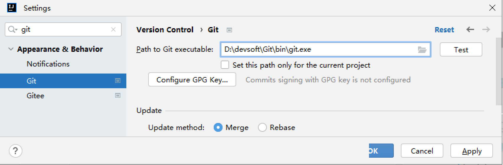

基础界面：

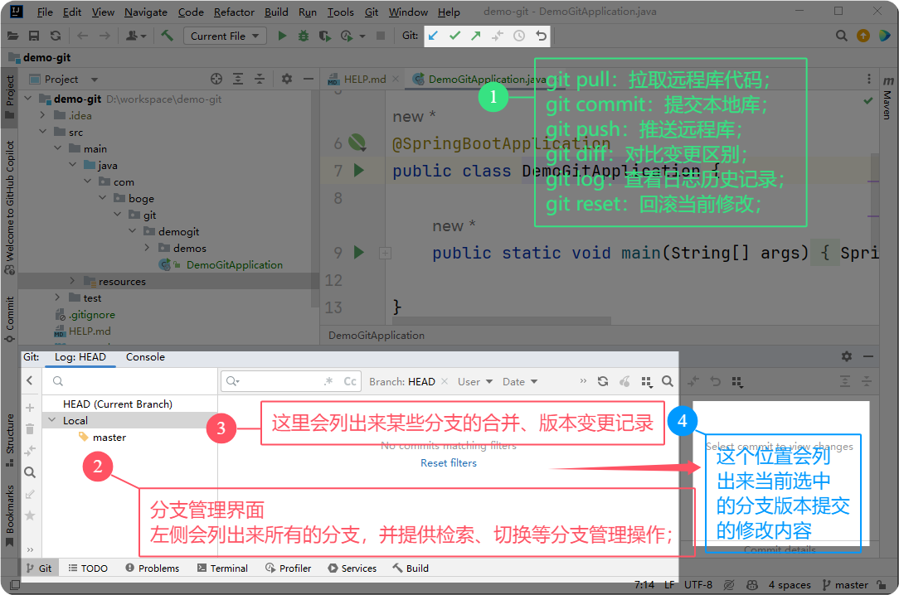

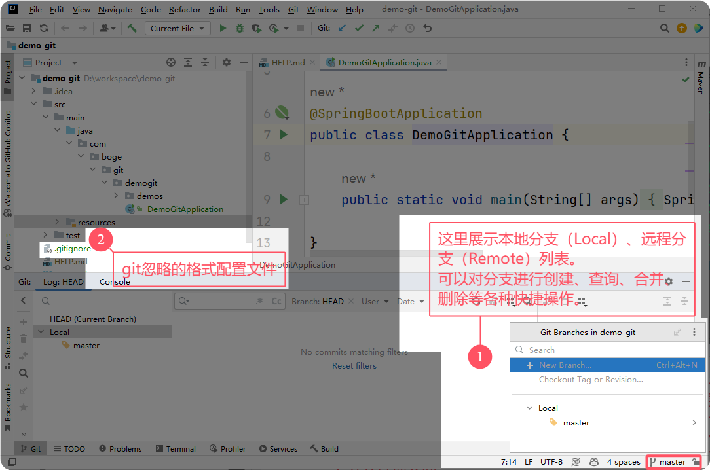

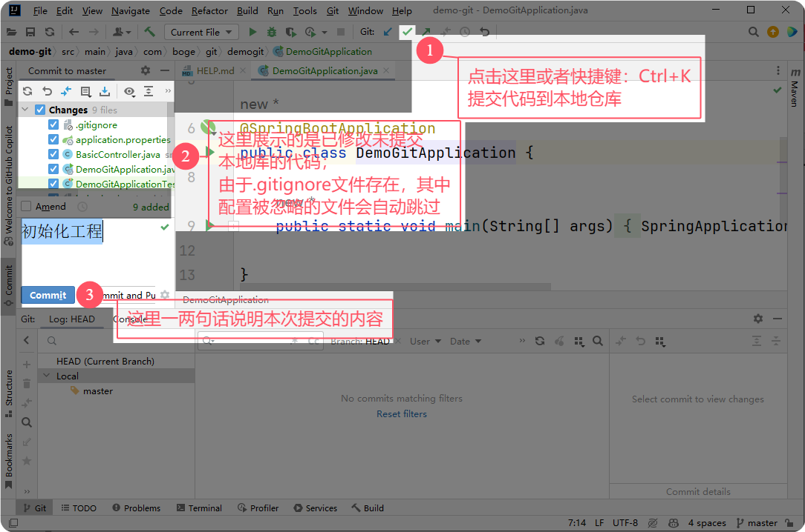


## 5.2 本地仓库常用操作

文件新增|文件修改|文件提交：通过状态栏快捷工具按钮、右键单独文件、ctrl+k快捷键均可以实现。

不同状态文件颜色对比：

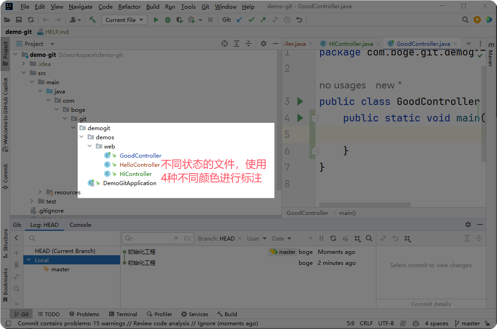

| 颜色                                  | 说明                                                         |
| ------------------------------------- | ------------------------------------------------------------ |
| <span style="color:red">红色</span>   | <span style="color:red">新建的文件，未受到git管理</span>     |
| <span style="color:green">绿色</span> | <span style="color:green">新建的文件，已经到暂存区（执行了`git add`命令），尚未提交（`git commit`）</span> |
| <span style="color:blue">蓝色</span>  | <span style="color:blue">已受到git仓库管理的文件，并且有新的修改，修改内容尚未提交</span> |
| <span style="color:black">黑色</span> | <span style="color:black">与本地库保持一致状态</span>        |
| <span style="color:gray">灰色</span>  | <span style="color:gray">不受git管理，如：.gitignore配置忽略的文件</span> |

git日志查看/片段代码历史修改查看：

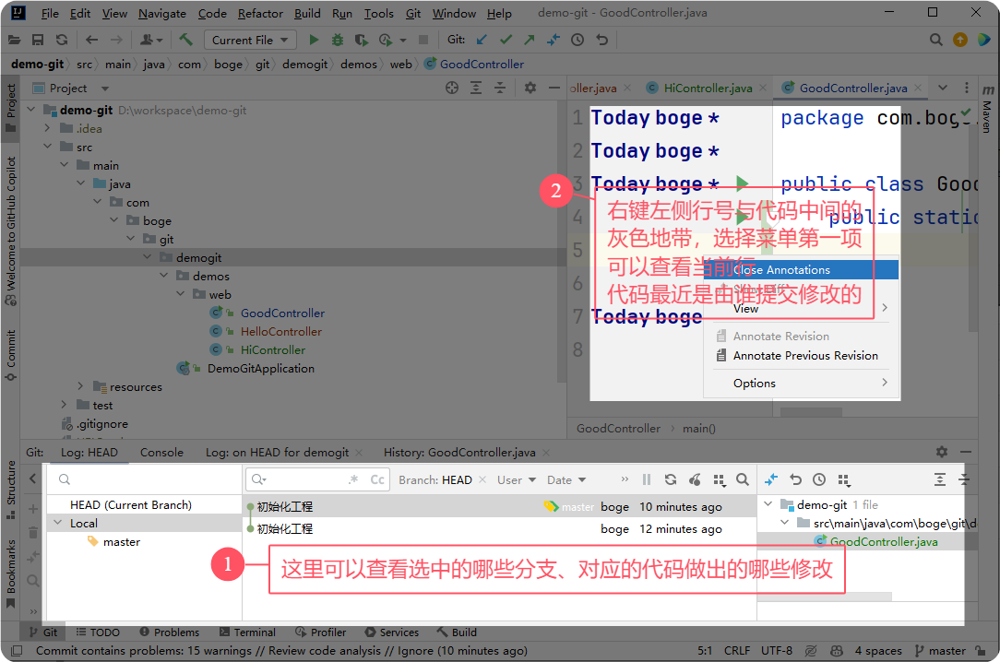

代码回滚：

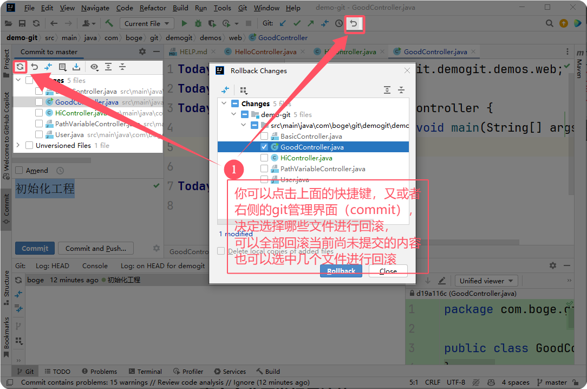

分支创建/删除/查看：分支合并：

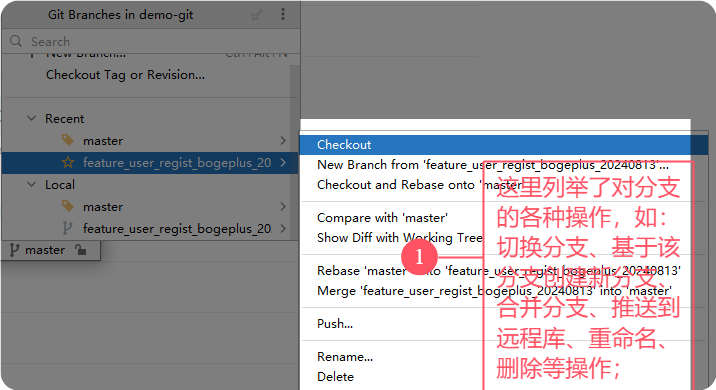 


## 5.3 真实企业开发场景演练

远程库操作：

​	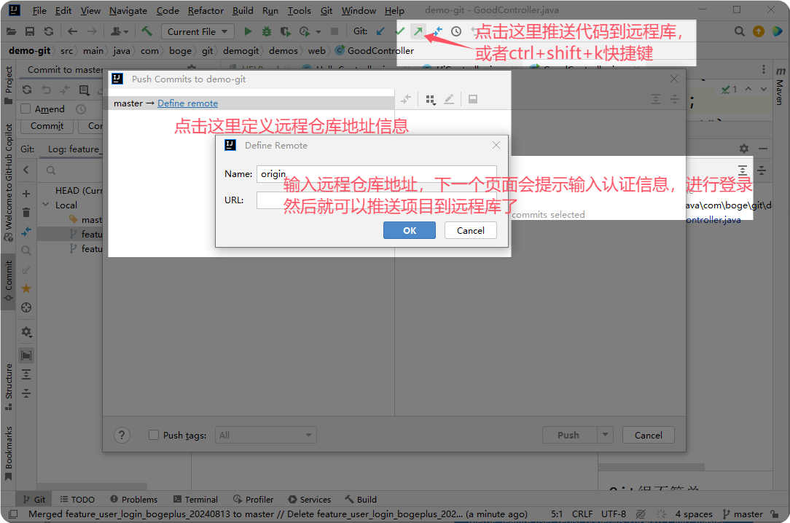

结合【3.4 真实企业工作流程】进行操作讲解。

## 5.5 使用idea处理冲突

使用Idea提供的窗口处理分支冲突：

1、提前创建两个分支，并且各自修改了相同的代码并提交到本地库；

2、合并分支：

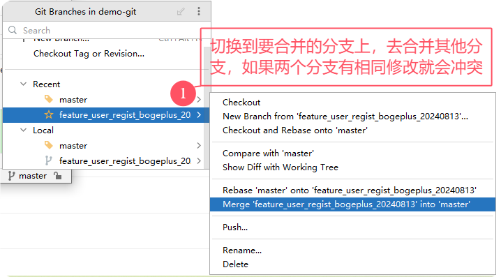 

3、处理冲突：

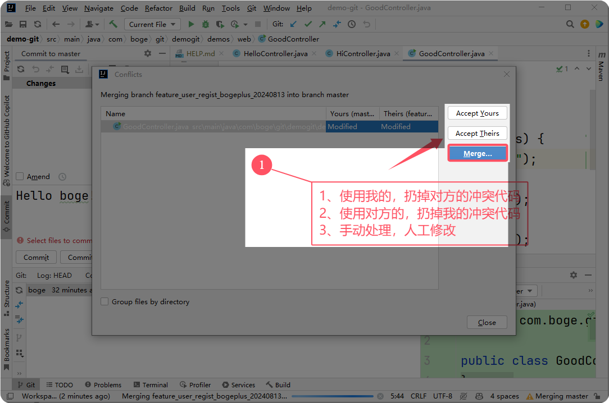


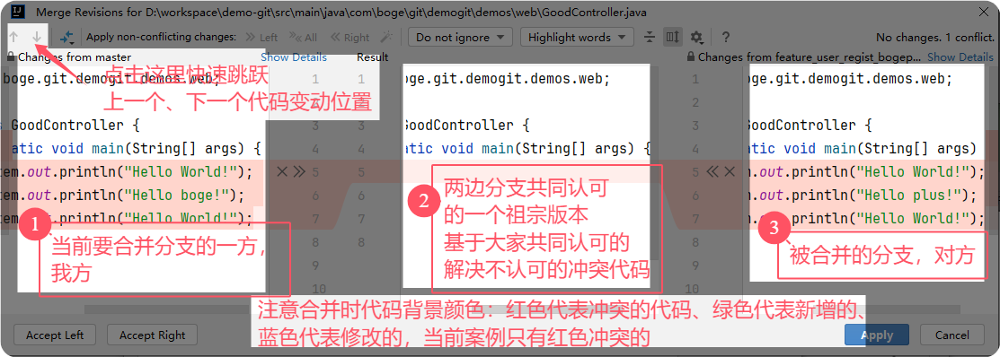

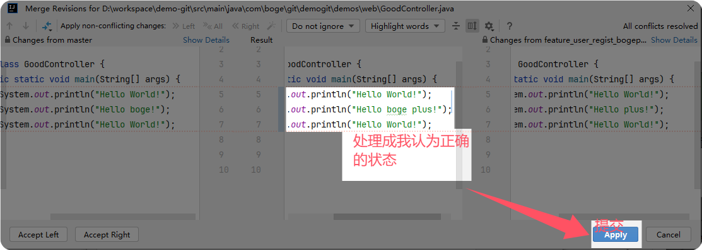


# 6. git其他必会技巧

## 6.1 Idea中如何查看分支的版本变化

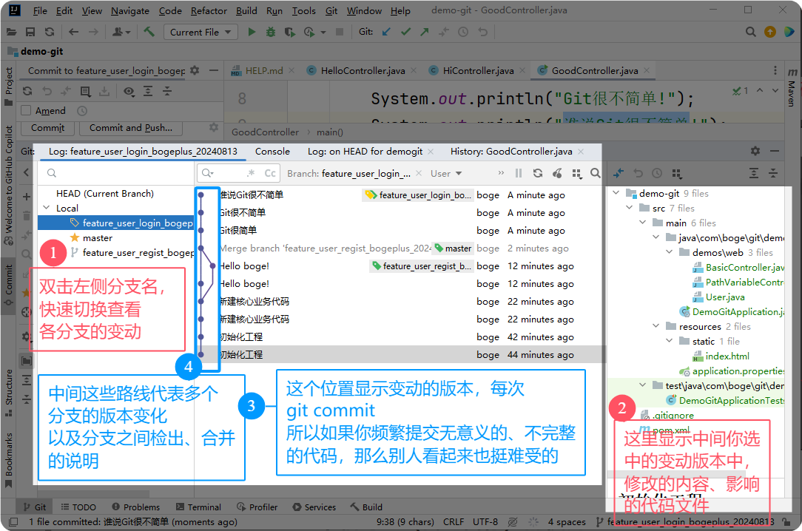


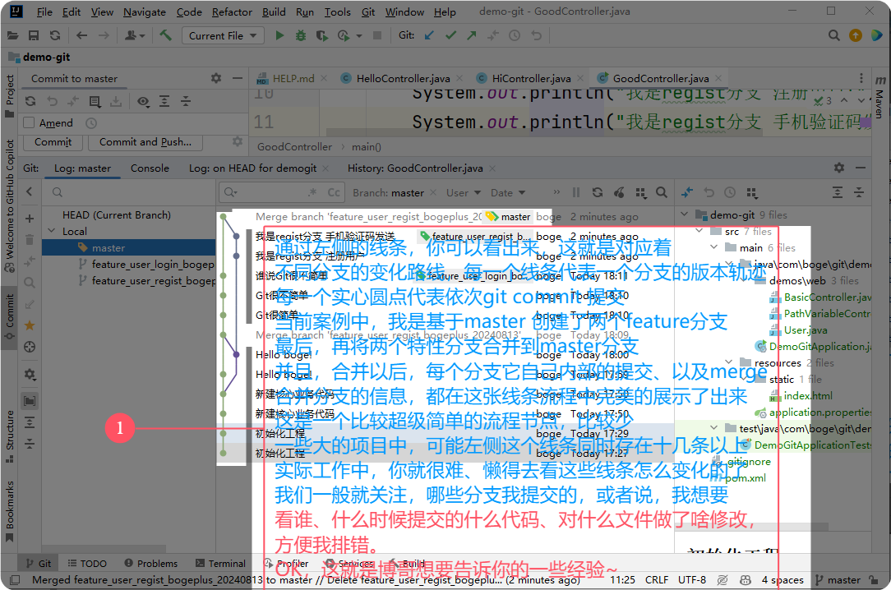

通过左侧的线条，你可以看出来，这就是对应着不同分支的变化路线，每一个线条代表一个分支的版本轨迹每一个实心圆点代表依次git commit 提交当前案例中，我是基于master 创建了两个feature分支最后，再将两个特性分支合并到master分支并且，合并以后，每个分支它自己内部的提交、以及merge合并分支的信息，都在这张线条流程中完美的展示了出来这是一个比较超级简单的流程节点，比较少一些大的项目中，可能左侧这个线条同时存在十几条以上实际工作中，你就很难、懒得去看这些线条怎么变化的了我们一般就关注，哪些分支我提交的，或者说，我想要看谁、什么时候提交的什么代码、对什么文件做了啥修改，方便我排错。
OK，这就是博哥想要告诉你的一些经验~


## 6.2 GitLab权限配置及分支保护

GitLab提供了分支保护功能，用于保护一些重要的分支。

GitLab提供了对用户的权限控制，同时通过权限控制，进一步实现对各种Gitlab中资源的控制，如：分支、代码提交、Tag标签、项目增删改查等等。

这部分内容，请大家移步看我的DevOps课程即可，这里我不再赘述。

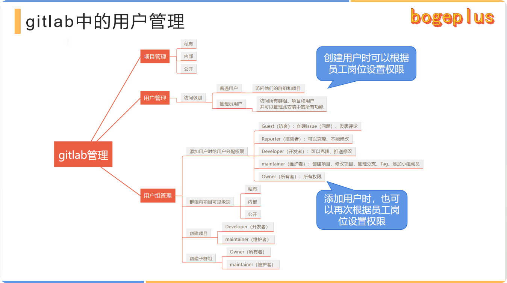

这里我简单说一下，保护分支的作用，就是用于防止不应该、不具备权限的用户，随意的去修改分支。

如：普通开发，随意的修改验收分支、正式分支、master分支的代码，可以吗？那肯定不可以。

所以说，不同的权限的用户，应该操作各自应该操作的分支。

那么，通过保护分支的设定，就可以实现：哪些分支必须具备什么权限的用户，才能去操作。

比如：master分支默认就是保护分支，不可以随便被普通组员进行修改。

这些分支操作，大家了解一下就行了，实际在公司中，小公司不用管，大公司直接告诉你应该往哪个分支提交，多余的你也不用去想。

# 7. Git常见面试题

## 7.1 你上家公司分支怎么管理的，按照什么思路划分任务以及创建分支？

答：

我上家公司项目一共分了7种类型的分支，分别是5个主干分支：master、dev、test、release、stable，以及两个日常工作 feature特性分支和bugfix漏洞修复分支。

我先给您介绍一下五个主干分支的含义：

- 首先是master分支存放与生产环境保持一致的代码，只能通过合并stable稳定分支上的代码进行更新。禁止其他分支或个人对master分支进行合并或者增删改操作；每当开始新一轮的需求时，我们会从master分支检出feature特性分支，或者bugfix漏洞修复分支进行开发。
- 然后是特性分支和bugfix分支就是我们研发程序员的日常工作的分支，可以按照需求类型、各人对项目的职责等维度，去创建自己的特性分支，开发需求或者修复漏洞，特性分支的权限是不限制的，命名规则就是feature或者bugfix开头，连接需求名称、开发人员、年月日作为分支名，这样方便管理和查找；
- 当前后端开发、自测没问题后，可以将特性分支或者修复分支的代码合并到dev开发分支，dev分支对应着dev服务器运行环境，日常工作中我们后端接口自测、前后端联调，部署的项目都是在测试环境；
- 当前后端自测没问题后，就要提交给测试人员，我们研发会将多个特性分支、修复分支合并到test分支上去，并基于test分支创建最新的git tag标签，代表我们要交付的版本，最后编写提测邮件，有哪些服务、分支以及那个tag标签标记的版本，都要写清楚，由测试或者运维去部署到测试服务器环境中去测试。
- 当测试通过后，那测试就会去申请验收，那就将特性分支、修复分支的代码合并到release验收分支，也使用git tag命令标记release分支的版本号，编写验收邮件，最后交给运维部署到UAT预生产环境，由产品团队进行验收；
- 如果一切正常的话，那就将特性分支、修复分支合并到stable稳定分支中去，等待投产日上线即可。当然也会基于stable创建当前要投产的git tag标记的版本号。
- 如果不顺利的话，比如测试验收失败、产品验收失败，那么哪个环节出问题，依次打回去，研发改完后，重复我说的这个流程，一直到完全验收通过。
- 最终，stable稳定版本的代码，要合并到master分支，下一次需求下发后，基于master分支检出新的特性分支或者bug修复分支，进行新一轮的研发周期。


## 7.2 什么情况下会遇到冲突，你怎么处理的？

答：一般是我提交代码，或者更新远程库代码的时候，容易产生冲突。

意思就是说，其他同事和我修改了相同的代码，IDEA这些工具没法自动合并处理，所以抛出给我手动处理。

我一般使用IDEA工具进行处理，借助他的窗口形式，对我的版本、原始版本、远程版本进行合并、修改，最后再提交就可以了。

当然，命令行的方式我也会，主要命令就是：git pull拉取代码，如果冲突的话，就会有一些等号和箭头来标注冲突的代码，然后我使用文本编辑器打开冲突文件，进行修改，修改完毕后，git add 、git commit重新提交处理完毕后的代码就可以了。


## 7.3 如何避免冲突？

答：我认为只要是团队合作，就不可能避免冲突。只能说，日常习惯中，有些操作是需要注意的，比如说：

​	避免idea快捷键：ctrl+alt+L格式化代码，有些老的代码，翻来覆去的改，可能就是没有格式化好，一旦我使用idea工具格式化一下，那就直接上百行的文件可能修改了，比如：运算符、括号前后加个空格、缩进什么的。但是这种方式极大概率会引起和别人的修改冲突，对吧，所以我修改不是我主要负责的模块的时候，我基本不会去格式化别人的代码。

还有就是，	在进行代码修改时，先pull，再修改，再push，降低冲突概率。

另外，我们组长在分配任务的时候，可以按照业务分配，尽少的多人编辑相同文件。

还有就是动别人分支前、后和人家说一下！我想大概就这些吧。

